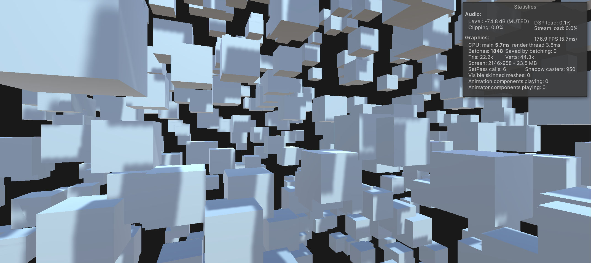

## JEcs - ECS architecture for game objects

In Unity, we have a default component such as Transform, Renderer, Collider, etc. So why not create an ECS based on the built-in Unity Components by simply adding systems to game objects, allowing for writing scalable modular code.

***

###  Baking
The library uses prototypes to create Entity, and all Unity Component objects are "baked" for quick access and filtering.

***

### Systems
Systems are written separately, and their updates are performed based on the set priority in the necessary callback - Update, FixedUpdate, LateUpdate.

    [ExecutionGroup(SystemGroup.Update), ExecutionOrder(100)]
    public class MovementSystem : ISystem
    {
        public void Update(HashSet<Entity> entities)
        {
            entities.Foreach<Transform, Velocity>((entity, transform, velocity) =>
            {
                transform.position += velocity.Value * Time.deltaTime;
            });
        }
    }

***

### World
Systems, like components, can be added and removed in real-time, and their sorting occurs during addition.

    _entityWorld = new EntityWorld();
    _entityWorld.AddSystem(new MovementSystem());
    _entityWorld.RemoveSystem<MovementSystem>();

`v0.0.3`
 

https://github.com/aleksandrpp/JEcs